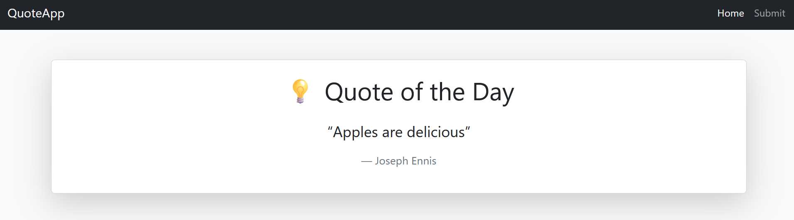
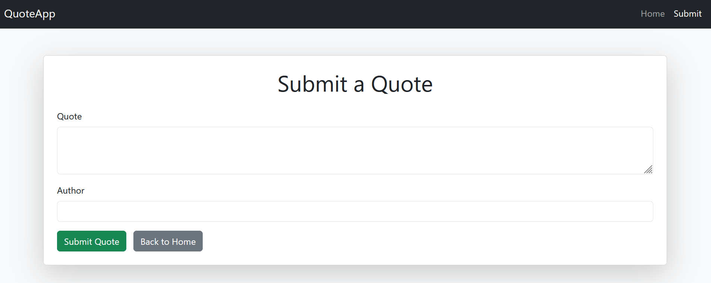

# Quote of the Day Web App

A simple, responsive web app built with **Flask** and **Bootstrap** that shows a random inspirational quote each time you visit. Users can also submit their own favorite quotes!

## Live Demo
Coming soon — will be hosted on [Render.com](https://render.com)

## Screenshots

Home Page | Submit Page
:-------------------------:|:-------------------------:
 | 

*(Add your own screenshots inside a `/static/screenshots/` folder and update paths here)*

---

## Features

-  Random inspirational quote on every page load
-  User quote submissions saved to a JSON file
-  Success message alert after submissions
-  Sticky navbar with Bootstrap
-  Fully responsive mobile-friendly design
-  API-ready backend for future expansion

---

## 🛠 Tech Stack

- **Python 3**
- **Flask** (web framework)
- **Bootstrap 5** (UI styling)
- **HTML5 / CSS3**
- **JSON** (quote storage)

---

## 🧑‍💻 How to Run Locally

```bash
git clone https://github.com/josephEnnis-dev/quoteApp
cd quoteApp
pip install flask
python app.py